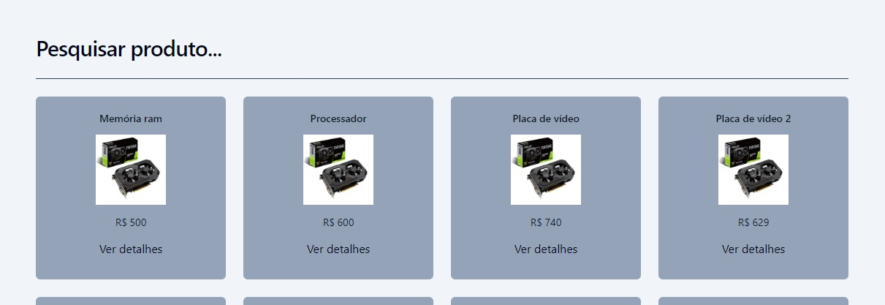
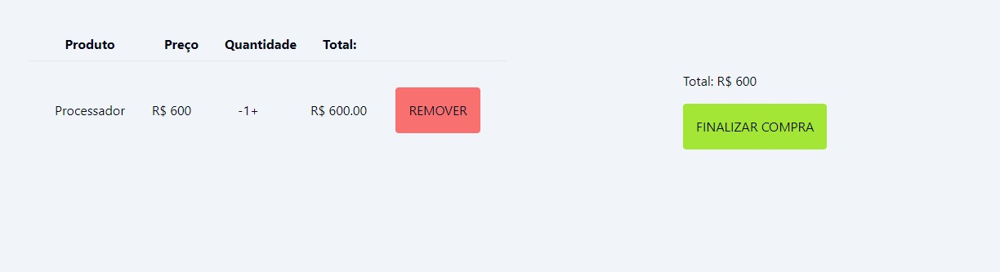

# Loja Online - Aplicação para vaga Front-end TGID

Este projeto é um simples projeto de loja online para uma vaga de front-end. A aplicação foi desenvolvida usando **React, Tailwind, Vitest e Axios**.

<h1 align="center">
    
    
</h1>

## 🚀 Desafio

Desenvolva um aplicativo simples em React (Ou usando JS puro caso não tenha
conhecimento em nenhum framework), simulando uma loja online, de forma que
consuma uma API REST (simule com o arquivo dbTeste.json utilizando a dependência
JSON Server). Nesse aplicativo você deverá listar os produtos, exibir cada um
individualmente e criar uma sistemática de carrinho de compras para que o usuário
adicione/remova os produtos que irá comprar e tenha, antes de finalizar sua compra,
um resumo do carrinho.

## 💻 Requisitos

Antes de iniciar, você deve ter o Node.js e o NPM instalados em sua máquina.

## 🚀 Instalando

Primeiro, você deve clonar o projeto:

```bash
git clone https://github.com/viniciusarashiro/tgid-teste.git
```

Depois, instale as dependências:

```bash
npm install
```

Por fim, execute o projeto:

```bash
npm run dev
```

## 🔧 Rodar testes

Para rodar os testes da aplicação, utilize o seguinte comando:

```bash
npm run test
```
